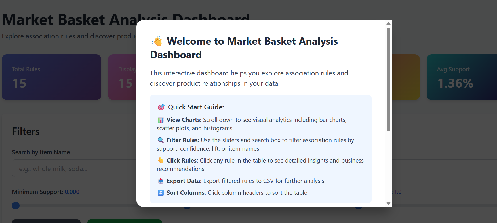
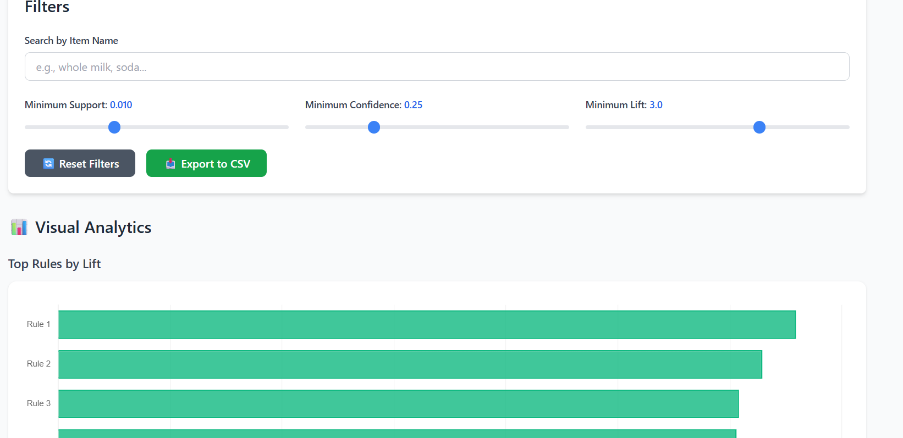
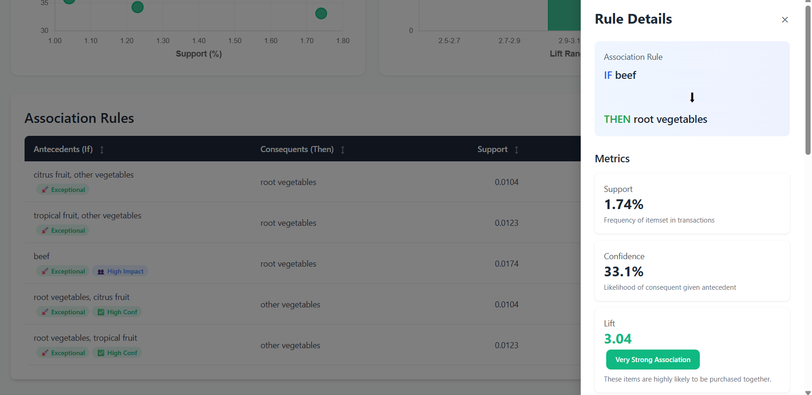

# 🛒 Market Basket Analysis Dashboard

An interactive web application for exploring and visualizing association rules from market basket analysis. This dashboard allows users to dynamically filter, sort, and analyze product association patterns to derive actionable business insights.

[](https://mba-dashboard.netlify.app/)
[](https://github.com/aflorentin001/mba-dashboard)

## 🌟 Features

### 📊 **Interactive Data Exploration**
- **Dynamic Filtering**: Real-time filtering with three adjustable sliders
  - Minimum Support (0% - 3%)
  - Minimum Confidence (0% - 100%)
  - Minimum Lift (1.0 - 4.0)
- **Search Functionality**: Find rules containing specific items
- **Sortable Table**: Click column headers to sort by any metric

### 📈 **Visualizations**
- **Scatter Plot**: Support vs. Confidence with lift-based bubble sizing
- **Bar Chart**: Top rules ranked by lift value
- **Real-time Updates**: All charts update automatically when filters change

### 🎯 **Rule Analysis**
- **Detailed Rule View**: Click any rule to see comprehensive analysis
- **Business Insights**: Contextual recommendations based on:
  - Lift strength (association power)
  - Confidence level (reliability)
  - Support frequency (market impact)
- **Strategic Recommendations**: Actionable business strategies including:
  - Bundle creation strategies
  - Store layout optimization
  - Email campaign targeting
  - Recommendation engine configuration

### 📤 **Data Export**
- **CSV Export**: Download filtered rules for further analysis
- **Statistics Summary**: View aggregate metrics for displayed rules

### 🎨 **User Experience**
- **Responsive Design**: Works seamlessly on desktop, tablet, and mobile
- **Professional UI**: Clean, modern interface with smooth animations
- **Error Handling**: Graceful handling of edge cases with helpful messages
- **Accessibility**: Keyboard navigation and screen reader support

## 🚀 Live Demo

**Visit the live application**: [https://mba-dashboard.netlify.app/](https://mba-dashboard.netlify.app/)

## 📸 Screenshots

### Dashboard Overview

*Main dashboard showing the rules table, filters, and visualizations*

### Interactive Filtering

*Dynamic filtering with real-time chart updates*

### Rule Details Panel

*Detailed business insights and recommendations for selected rules*

## 🛠️ Technologies Used

- **Frontend Framework**: Vanilla JavaScript (no framework dependencies)
- **Styling**: [Tailwind CSS](https://tailwindcss.com/) via CDN
- **Visualizations**: [Chart.js](https://www.chartjs.org/) v4.4.0
- **Deployment**: [Netlify](https://www.netlify.com/)
- **Version Control**: Git & GitHub

## 📦 Installation & Setup

### Option 1: View Live Demo (Recommended)
Simply visit: [https://mba-dashboard.netlify.app/](https://mba-dashboard.netlify.app/)

### Option 2: Run Locally

1. **Clone the repository**
   ```bash
   git clone https://github.com/aflorentin001/mba-dashboard.git
   cd mba-dashboard
   ```

2. **Open in browser**
   ```bash
   # Simply open the index.html file in your browser
   # No build process or dependencies needed!
   
   # On macOS:
   open index.html
   
   # On Windows:
   start index.html
   
   # On Linux:
   xdg-open index.html
   ```

3. **Or use a local server** (optional, but recommended)
   ```bash
   # Using Python 3
   python -m http.server 8000
   
   # Using Node.js
   npx http-server
   
   # Then visit http://localhost:8000
   ```

## 📖 How to Use

### 1. **Explore Rules**
- The main table displays all association rules from the Market Basket Analysis
- Each row shows: Rule #, Antecedents, Consequents, Support, Confidence, and Lift

### 2. **Filter Data**
- Use the sliders in the left panel to filter rules:
  - **Support**: Frequency of the rule in transactions
  - **Confidence**: Probability of consequent given antecedent
  - **Lift**: Strength of the association (values > 1 indicate positive correlation)
- Use the search box to find rules containing specific items

### 3. **Sort Results**
- Click any column header to sort ascending/descending
- Click again to reverse sort order

### 4. **View Details**
- Click on any rule row to open the details panel
- Review comprehensive business insights and recommendations
- Close the panel by clicking the X or anywhere outside

### 5. **Analyze Visually**
- Scroll to the charts section to see visual representations
- **Scatter Plot**: Understand the relationship between support and confidence
- **Bar Chart**: Identify the strongest associations by lift value

### 6. **Export Results**
- Click "Export to CSV" to download filtered rules
- Use exported data for presentations or further analysis in Excel/Python

## 📊 Understanding the Metrics

### **Support**
- **Definition**: Frequency of the itemset in all transactions
- **Formula**: Support(A,B) = P(A ∩ B)
- **Interpretation**: Higher support = more common pattern
- **Business Use**: Prioritize high-support rules for broad market impact

### **Confidence**
- **Definition**: Likelihood of B being purchased when A is purchased
- **Formula**: Confidence(A→B) = Support(A,B) / Support(A)
- **Interpretation**: Higher confidence = stronger predictive power
- **Business Use**: High-confidence rules are reliable for recommendations

### **Lift**
- **Definition**: How much more likely items are purchased together vs. independently
- **Formula**: Lift(A→B) = Support(A,B) / (Support(A) × Support(B))
- **Interpretation**: 
  - Lift > 1: Positive correlation (items bought together)
  - Lift = 1: No correlation (independent)
  - Lift < 1: Negative correlation (items rarely bought together)
- **Business Use**: Focus on lift > 2.5 for strong bundling opportunities

## 🎯 Business Applications

This dashboard enables several business strategies:

### 1. **Product Bundling**
- Identify items with high lift (>3.0) for promotional bundles
- Create "Frequently Bought Together" displays

### 2. **Store Layout Optimization**
- Place high-support associated items near each other
- Design end-cap displays based on strong rules

### 3. **Recommendation Systems**
- Implement auto-suggest features using high-confidence rules
- Personalize product recommendations on e-commerce sites

### 4. **Marketing Campaigns**
- Target customers who bought item A with offers for item B
- Design email campaigns around strong associations

### 5. **Inventory Management**
- Stock complementary items together
- Adjust inventory levels based on association patterns

## 📁 Project Structure

```
mba-dashboard/
│
├── index.html              # Main application file (all-in-one)
├── index-backup.html       # Backup version
├── README.md              # This file
├── .gitignore             # Git ignore rules
├── netlify.toml           # Netlify deployment configuration
├── _redirects             # URL redirect rules
│
├── push-to-github         # Git push script (Windows)
└── update-git             # Git update script (Windows)
```

## 🔧 Customization

### Modify the Dataset

To use your own association rules, edit the `associationRules` array in `index.html`:

```javascript
const associationRules = [
    {
        antecedents: 'Your Item A',
        consequents: 'Your Item B',
        support: 0.015,      // 1.5%
        confidence: 0.35,    // 35%
        lift: 2.85
    },
    // Add more rules...
];
```

### Adjust Filter Ranges

Modify the slider ranges in the HTML:

```html
<!-- Example: Change support range -->
<input type="range" 
       min="0" 
       max="0.05"     <!-- Increase max value -->
       step="0.001" 
       value="0.01">
```

### Customize Styling

The application uses Tailwind CSS classes. Common customizations:

```javascript
// Change color scheme
'bg-blue-500'  →  'bg-purple-500'  // Change primary color
'text-gray-700' →  'text-gray-900'  // Darker text

// Adjust spacing
'p-4'  →  'p-6'  // Increase padding
'mb-4' →  'mb-8' // Increase margin
```

## 🚀 Deployment

### Deploy to Netlify (Current Hosting)

1. **Connect Repository**
   - Go to [Netlify](https://netlify.com)
   - Click "Add new site" → "Import an existing project"
   - Connect your GitHub repository

2. **Configure Build Settings**
   - Build command: (leave empty - no build needed)
   - Publish directory: `/` (root directory)

3. **Deploy**
   - Click "Deploy site"
   - Your site will be live at `your-site-name.netlify.app`

### Alternative Deployment Options

#### GitHub Pages
```bash
# Enable GitHub Pages in repository settings
# Set source to main branch, / (root)
# Access at: https://yourusername.github.io/mba-dashboard
```

#### Vercel
```bash
# Install Vercel CLI
npm i -g vercel

# Deploy
vercel
```

## 🧪 Testing

Since this is a vanilla JavaScript application, testing can be done manually:

### Test Checklist
- [ ] All filters update the table correctly
- [ ] Search functionality works with partial matches
- [ ] Sorting works for all columns
- [ ] Rule details panel opens and closes properly
- [ ] Charts update when filters change
- [ ] Export to CSV downloads correct data
- [ ] Responsive design works on mobile
- [ ] No console errors in browser developer tools

### Browser Compatibility
- ✅ Chrome/Edge (latest)
- ✅ Firefox (latest)
- ✅ Safari (latest)
- ✅ Mobile browsers (iOS Safari, Chrome)

## 📚 Data Source

The association rules in this dashboard were generated using:
- **Algorithm**: Apriori algorithm
- **Dataset**: Grocery store transaction data
- **Analysis Tool**: Python (pandas, mlxtend)
- **Parameters**:
  - Minimum support: 0.01 (1%)
  - Minimum confidence: 0.25 (25%)
  - Minimum lift: 2.5

For the complete analysis notebook, see the associated Jupyter notebook in the course submission.

## 🤝 Contributing

This project was created as part of an academic assignment. While it's primarily for educational purposes, suggestions and improvements are welcome!

1. Fork the repository
2. Create a feature branch (`git checkout -b feature/improvement`)
3. Commit your changes (`git commit -m 'Add some improvement'`)
4. Push to the branch (`git push origin feature/improvement`)
5. Open a Pull Request

## 📝 License

This project is created for educational purposes as part of a Data Mining course assignment.

## 👤 Author

**Alejandra Florentin**
- GitHub: [@aflorentin001](https://github.com/aflorentin001)
- Project: [Market Basket Analysis Dashboard](https://mba-dashboard.netlify.app/)

## 🙏 Acknowledgments

- Course: Data Mining (Module 1 - Market Basket Analysis)
- Institution: [Your University Name]
- Tools: Windsurf AI for development assistance
- Libraries: Tailwind CSS, Chart.js
- Hosting: Netlify

## 📞 Support

If you encounter any issues or have questions:
1. Check the [Issues](https://github.com/aflorentin001/mba-dashboard/issues) page
2. Open a new issue with a detailed description
3. Include browser version and steps to reproduce

---

**⭐ If you find this project helpful, please consider giving it a star on GitHub!**

**🔗 Live Demo**: [https://mba-dashboard.netlify.app/](https://mba-dashboard.netlify.app/)